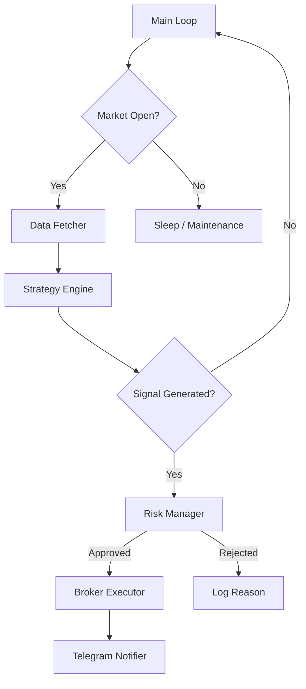

# Complete System Integration Example

이 문서는 개별적으로 정의된 컴포넌트(브로커, 전략, 리스크 관리)를 하나의 **실행 가능한 오토노머스 트레이딩 봇**으로 통합하는 전체 구조를 제공합니다.

---

## 🏗️ System Architecture



---

## 💻 `main_bot.py` Template

```python
import os
import time
import schedule
import logging
from datetime import datetime
from dotenv import load_dotenv

# === Custom Modules (Based on other references) ===
from brokers.alpaca_interface import AlpacaTrader
from strategies.momentum import MACDStrategy
from risk.manager import RiskManager
from utils.telegram import TelegramNotifier
from utils.logger import setup_logger

# Load Environment Variables
load_dotenv()

# === Configuration ===
CONFIG = {
    "symbol": "BTC/USD",      # 트레이딩 대상
    "timeframe": "1h",        # 시간 프레임
    "risk_per_trade": 0.01,   # 거래당 리스크 1%
    "max_drawdown": 0.15,     # 최대 낙폭 15%
    "paper_mode": True,       # 페이퍼 트레이딩 여부
    "sleep_interval": 60      # 루프 대기 시간 (초)
}

class AutoTradingBot:
    def __init__(self):
        self.logger = setup_logger("AutoBot")
        self.notifier = TelegramNotifier()
        
        # 1. Initialize Broker
        self.logger.info("Connecting to Broker...")
        self.broker = AlpacaTrader(paper=CONFIG["paper_mode"])
        
        # 2. Initialize Strategy
        self.strategy = MACDStrategy(fast=12, slow=26, signal=9)
        
        # 3. Initialize Risk Manager
        self.risk_manager = RiskManager(
            initial_capital=self.broker.get_account()["equity"],
            max_drawdown=CONFIG["max_drawdown"]
        )
        
        self.is_running = True
        self.logger.info("Bot Initialized Successfully")

    def run_cycle(self):
        """싱글 트레이딩 사이클 실행"""
        try:
            current_time = datetime.now()
            self.logger.info(f"--- Cycle Start: {current_time} ---")
            
            # 1. Fetch Data
            # 브로커로부터 최근 OHLCV 데이터 수신
            historical_data = self.broker.get_bars(
                symbol=CONFIG["symbol"], 
                timeframe=CONFIG["timeframe"], 
                limit=100
            ) 
            
            current_price = historical_data['close'].iloc[-1]
            self.logger.info(f"Current Price: ${current_price:,.2f}")

            # 2. Check for Signals
            # 전략 엔진을 통해 매수/매도 시그널 생성
            signal = self.strategy.generate_signal(historical_data)
            self.logger.info(f"Strategy Signal: {signal}")

            if signal == "HOLD":
                return

            # 3. Risk Assessment
            # 현재 포트폴리오 상태 조회
            account_info = self.broker.get_account()
            positions = self.broker.get_positions()
            
            # 거래 제안서 작성
            stop_loss_price = self.strategy.calculate_stop_loss(historical_data, signal)
            trade_proposal = {
                "symbol": CONFIG["symbol"],
                "action": signal,  # BUY or SELL
                "price": current_price,
                "stop_loss": stop_loss_price,
                "capital": account_info["equity"]
            }

            # 리스크 매니저 승인 요청 (3-way debate 내부 수행)
            risk_decision = self.risk_manager.evaluate_trade(
                trade_proposal, 
                portfolio={"positions": positions, "total_value": account_info["equity"]}
            )

            if not risk_decision["approved"]:
                self.logger.warning(f"Trade Rejected by Risk Manager: {risk_decision['reasoning']}")
                return

            # 4. Execute Trade
            # 승인된 수량만큼 주문 실행
            quantity = risk_decision["final_shares"]
            
            if quantity > 0:
                self.logger.info(f"Executing {signal} order for {quantity} units...")
                
                execution = self.broker.place_order(
                    symbol=CONFIG["symbol"],
                    qty=quantity,
                    side=signal,
                    order_type="market",
                    stop_loss=stop_loss_price
                )
                
                # 5. Notify
                self.notifier.send_trade_alert(
                    action=signal,
                    symbol=CONFIG["symbol"],
                    qty=quantity,
                    price=current_price
                )
                self.logger.info(f"Trade Executed: {execution['id']}")

        except Exception as e:
            self.logger.error(f"Error in cycle: {str(e)}")
            self.notifier.send_message(f"🚨 Bot Error: {str(e)}")

    def start(self):
        """메인 루프 시작"""
        self.logger.info("Starting Main Loop...")
        self.notifier.send_message("🤖 Trading Bot Started")
        
        while self.is_running:
            # 킬 스위치 체크
            if self.risk_manager.kill_switch_active:
                self.logger.critical("Kill Switch Activated! Stopping Bot.")
                self.notifier.send_kill_switch_alert("Risk threshold breached")
                break
            
            self.run_cycle()
            time.sleep(CONFIG["sleep_interval"])

if __name__ == "__main__":
    bot = AutoTradingBot()
    bot.start()
```

---

## 📁 Project Directory Structure

이 코드를 실행하기 위한 권장 프로젝트 구조입니다:

```
trading_bot/
├── main.py                 # 위 코드가 들어갈 메인 진입점
├── .env                    # API 키 등 환경 변수
├── brokers/
│   ├── __init__.py
│   ├── base.py            # Broker 추상 클래스
│   └── alpaca_interface.py
├── strategies/
│   ├── __init__.py
│   ├── base.py            # Strategy 추상 클래스
│   └── momentum.py        # MACD, RSI 등 구현
├── risk/
│   ├── __init__.py
│   └── manager.py         # 3-Way Debate & Limits
└── utils/
    ├── __init__.py
    ├── logger.py
    └── telegram.py
```

---

## 🚀 How to Customize

1. **브로커 변경**: `AlpacaTrader` 대신 `IBKRTrader`나 `OKXTrader`로 교체 (Interface 규격 준수)
2. **전략 변경**: `MACDStrategy` 대신 `MeanReversionStrategy` 등으로 교체
3. **리스크 설정**: `CONFIG` 딕셔너리에서 최대 낙폭 및 리스크 비율 조정
4. **다중 종목**: `CONFIG["symbol"]`을 리스트로 변경하고 루프 내에서 순회하도록 수정

---

## 🛑 Pre-Flight Checklist

봇을 실행하기 전 반드시 확인하세요:

- [ ] `.env` 파일에 API Key가 올바르게 설정되었는가?
- [ ] Paper Trading 모드가 `True`로 설정되었는가? (첫 실행 시 필수)
- [ ] 텔레그램 봇 토큰이 유효한가? (알림 수신 확인)
- [ ] 초기 자본금이 충분한가?
- [ ] 로그 파일이 생성되는지 확인했는가?
